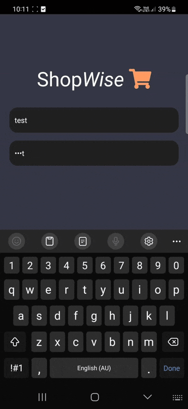

## Project Name

1Trip

## Description

1Trip is a software application designed to simplify the process of planning and organising shopping trips. It offers users a user-friendly interface to create and manage shopping lists and individual products.

## Progress and Next Steps

- **Current Status**: The core functionality of the front-end is complete.
- **Next Steps**:
  1. **Testing**: Validate functionality to ensure smooth user experience and resolve any bugs.
  2. **Gold Plating**: Further refine and beautify the user interface (UI) to enhance usability and visual appeal.

## Preview

### Login

### Creating Shopping List

### Products List

### Shopping

## Built With

- 
- 
- 
